# AI Sales Automation Platform

> An end-to-end AI-powered sales automation platform that automates outbound prospecting and inbound customer engagement using n8n workflows integrated with CRM, email, scheduling, and voice services.

<p align="center">
  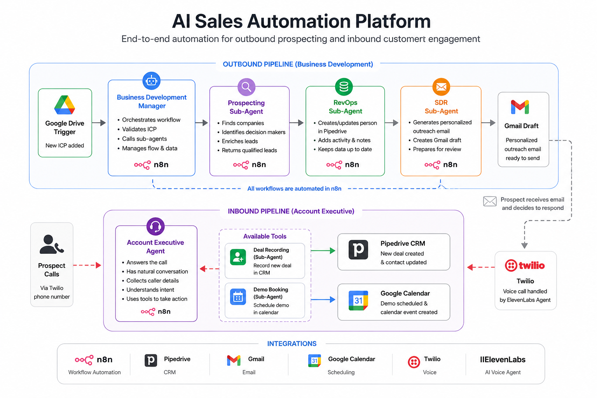
</p>

---

## Overview

This project demonstrates a complete AI-driven sales automation system built around workflow orchestration.

The platform automates the complete sales lifecycle:

- Finding companies that match an Ideal Customer Profile (ICP)
- Identifying qualified decision makers
- Recording and updating CRM contacts
- Generating personalized outreach emails
- Handling inbound customer calls
- Recording sales opportunities
- Scheduling product demonstrations automatically

The solution is built primarily with **n8n** workflows and integrates with several external business services.

---

# Features

### Outbound Sales Automation

- Prospect discovery
- Decision-maker identification
- CRM synchronization
- Duplicate prevention
- Personalized outreach email generation
- Gmail draft creation

### Inbound Customer Engagement

- AI-assisted customer conversations
- Automatic deal recording
- Demo scheduling
- Calendar event creation
- CRM updates

---

# Project Structure

```text
AI-SALES-AUTOMATION-PLATFORM
│
├── architecture/
│   ├── architecture.md
│   └── system-architecture.png
│
├── docs/
│   ├── integrations.md
│   ├── setup.md
│   └── workflow-overview.md
│
├── n8n-workflows/
│   ├── README.md
│   │
│   ├── account-executive/
│   │   ├── deal-recording-sub-agent.json
│   │   └── demo-booking-sub-agent.json
│   │
│   └── business-development/
│       ├── business-development-manager.json
│       ├── prospecting-sub-agent.json
│       ├── revops-sub-agent.json
│       └── sdr-sub-agent.json
│
├── screenshots/
│
├── .env.example
│
└── README.md
```

---

# System Architecture

The platform consists of two independent automation pipelines that together cover both outbound prospecting and inbound customer engagement.

- **Business Development Pipeline**
  - Finds qualified prospects
  - Creates or updates CRM contacts
  - Generates personalized outreach emails

- **Account Executive Pipeline**
  - Handles inbound customer requests
  - Records sales opportunities
  - Schedules product demonstrations

The overall architecture is illustrated below.

<p align="center">
  
</p>

---

# Workflow Overview

## Business Development Manager

Acts as the main orchestrator of the outbound pipeline.

Responsibilities:

- Coordinates all outbound workflows
- Passes data between workflows
- Controls workflow execution
- Returns the final sales-ready prospects

<p align="center">
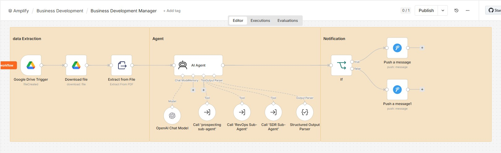
</p>

---

## Prospecting Sub-Agent

Searches for organizations that match the Ideal Customer Profile.

Responsibilities

- Find matching companies
- Identify decision makers
- Collect contact information
- Return qualified leads

Output

- Company
- Contact Name
- Job Title
- Email Address

<p align="center">
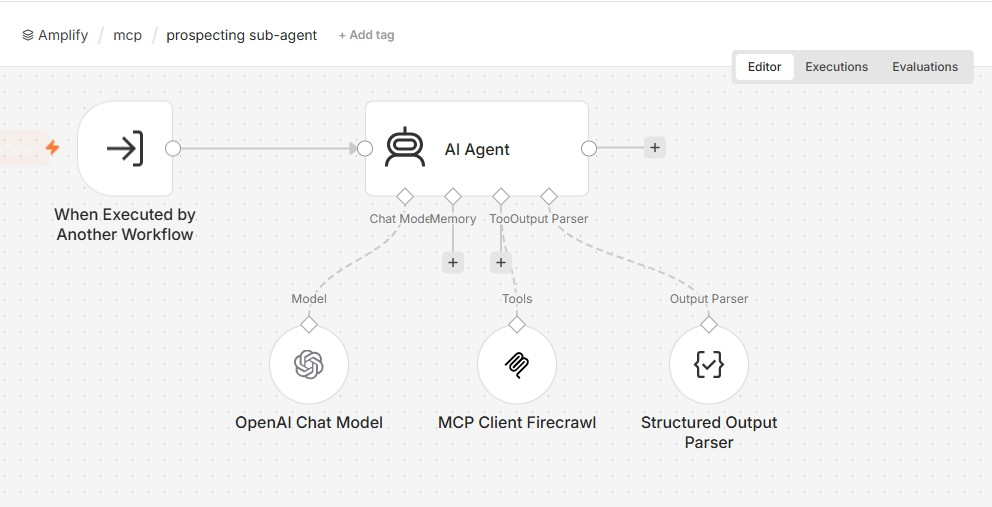
</p>

---

## RevOps Sub-Agent

Synchronizes prospect information with the CRM.

Responsibilities

- Search existing contacts
- Prevent duplicates
- Create new contacts
- Update existing contacts

<p align="center">
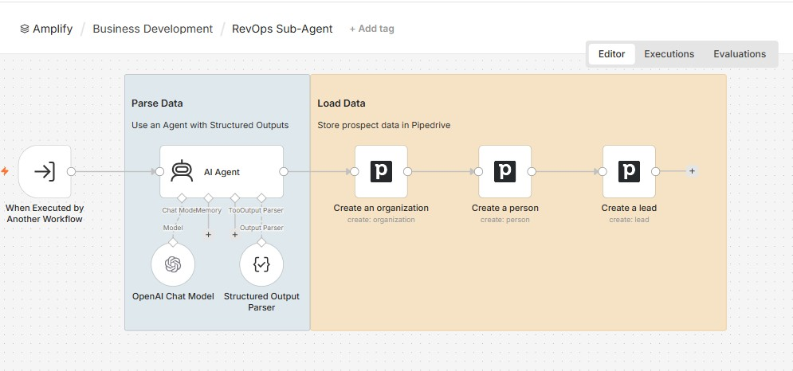
</p>

---

## SDR Sub-Agent

Creates personalized outreach emails.

Responsibilities

- Generate email subject
- Generate personalized email body
- Save draft in Gmail

<p align="center">
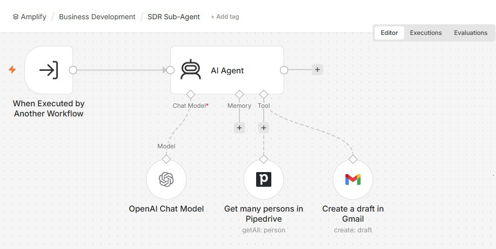
</p>

---

## Deal Recording Sub-Agent

Records inbound callers as sales opportunities.

Responsibilities

- Create a new Deal
- Associate the deal with an existing contact
- Update CRM records

<p align="center">
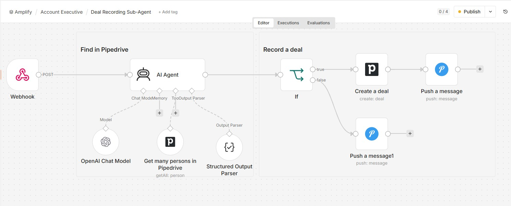
</p>

---

## Demo Booking Sub-Agent

Schedules product demonstrations.

Responsibilities

- Create calendar event
- Reserve requested time slot
- Return booking confirmation

<p align="center">
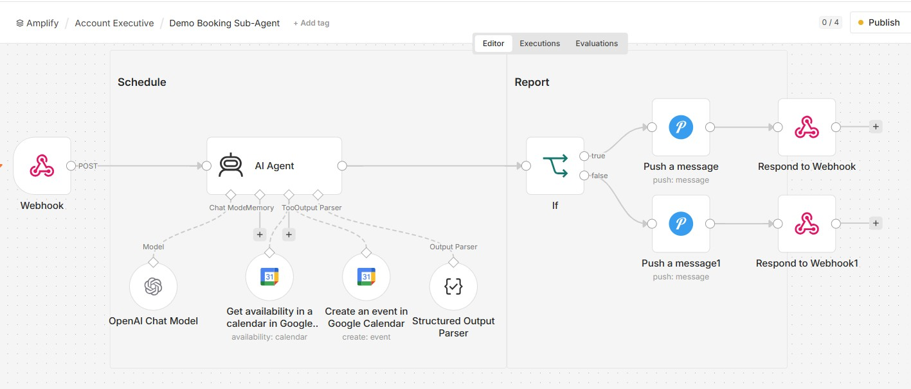
</p>

---

# Integrations

## CRM

### Pipedrive

Used for

- Contact management
- Organization management
- Deal management
- Activity tracking

<p align="center">
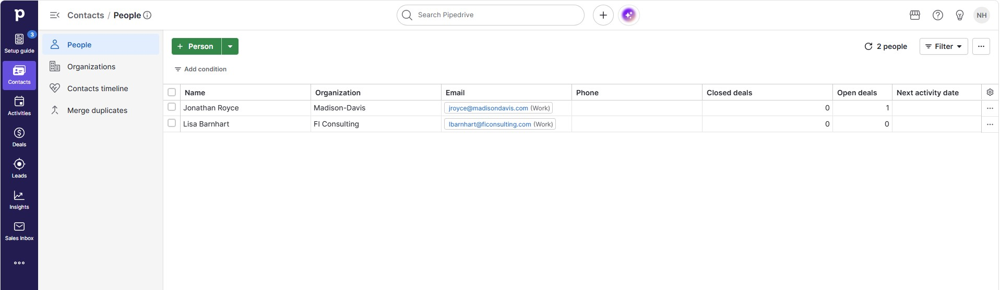
</p>

---

## Email

### Gmail

Used for

- Personalized outreach drafts
- Sales email preparation

<p align="center">
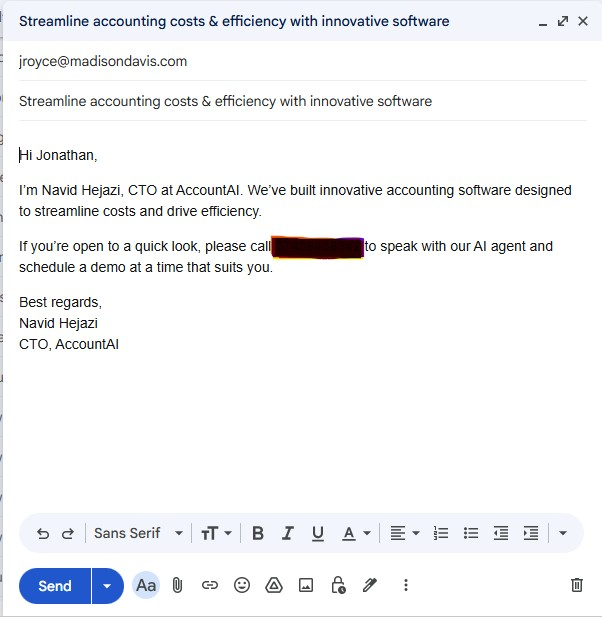
</p>

---

## Scheduling

### Google Calendar

Used for

- Demo scheduling
- Meeting creation
- Appointment management

<p align="center">
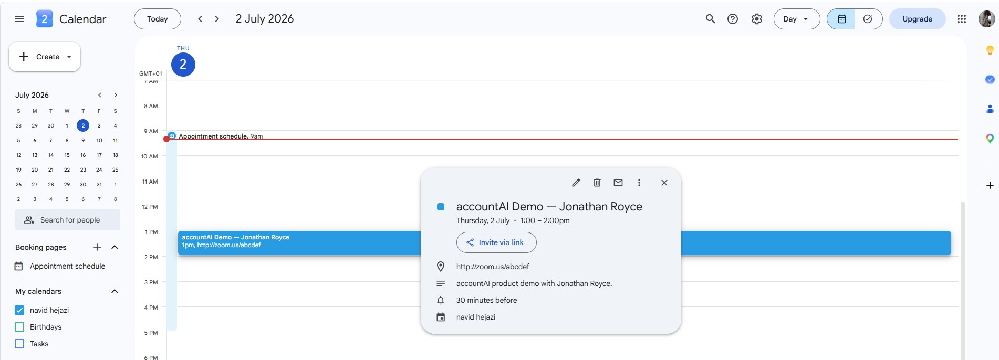
</p>

---

## Voice Configuration

The account executive configuration exposes the automation tools required for recording customer opportunities and scheduling demonstrations.

<p align="center">
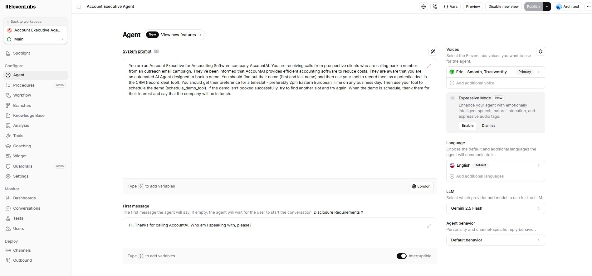
</p>

---

## Available Tools

The account executive can invoke dedicated automation tools during customer interactions.

<p align="center">

</p>

---

# Technologies

| Category | Technologies |
|----------|--------------|
| Workflow Automation | n8n |
| CRM | Pipedrive |
| Email | Gmail |
| Scheduling | Google Calendar |
| Voice | Twilio |
| Conversational AI | ElevenLabs |
| LLM | Gemini 2.5 Flash |

---

# Documentation

Additional documentation can be found in the `docs` directory.

| File | Description |
|------|-------------|
| architecture.md | Platform architecture |
| workflow-overview.md | Description of each workflow |
| integrations.md | Connected services |
| setup.md | Setup instructions |

---

# Getting Started

1. Clone the repository.

```bash
git clone https://github.com/<username>/ai-sales-automation-platform.git
```

2. Import the workflows into n8n.

3. Configure your credentials.

4. Update the environment variables.

5. Activate the workflows.

---

# Environment Variables

Create a `.env` file using `.env.example`.

Example:

```env
PIPEDRIVE_API_KEY=
GMAIL_CREDENTIALS=
GOOGLE_CALENDAR_CREDENTIALS=
TWILIO_ACCOUNT_SID=
TWILIO_AUTH_TOKEN=
```

---

# Future Improvements

- Automatic lead scoring
- CRM analytics dashboard
- Follow-up automation
- Multi-language conversations
- Multi-CRM support
- Slack notifications
- Microsoft Teams integration

---

# Author

**Navid Hejazi**

GitHub  
https://github.com/seyyednavid

LinkedIn  
https://www.linkedin.com/in/navid-hejazi/

---

## License

This project is provided for educational and portfolio purposes.